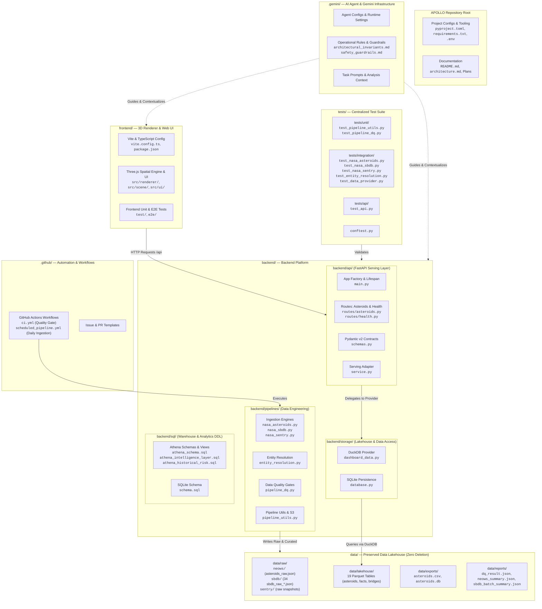
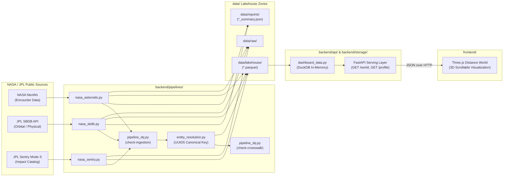
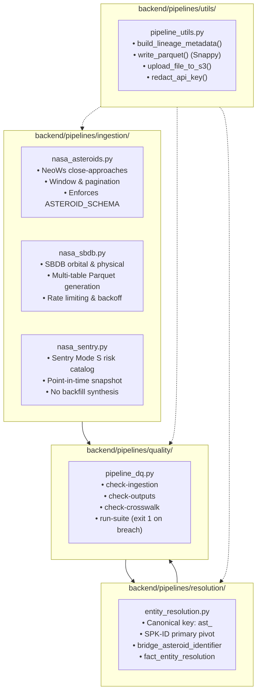
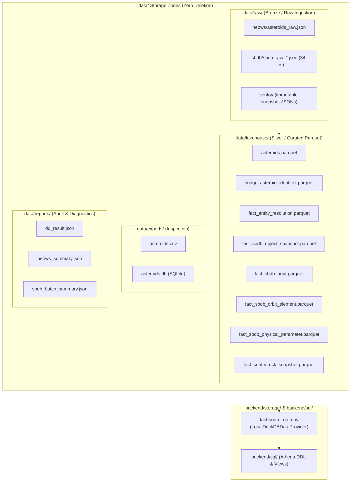
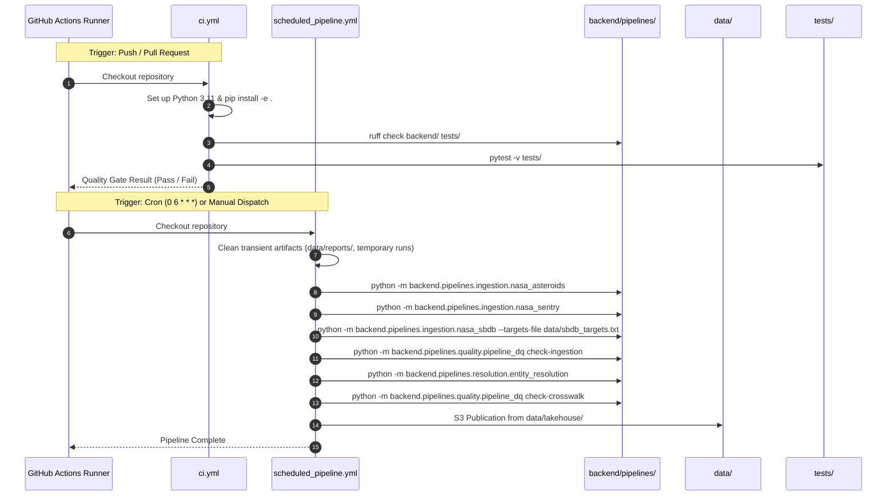
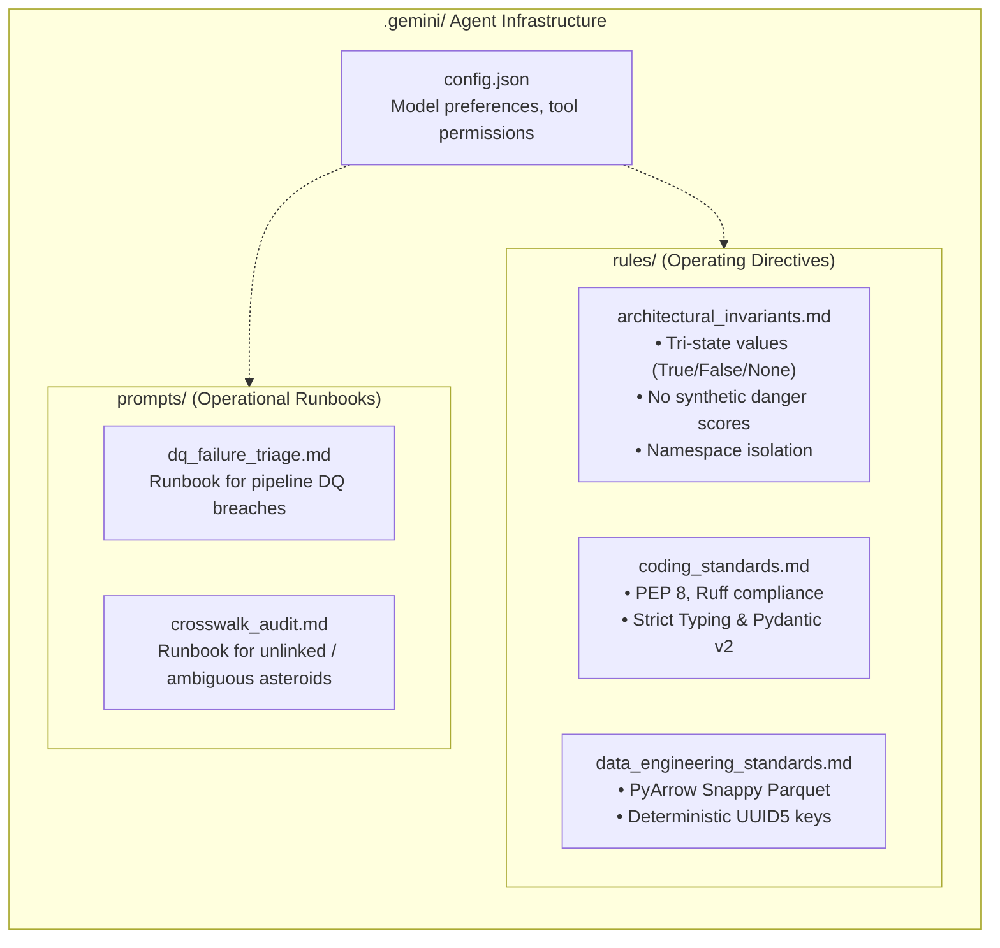
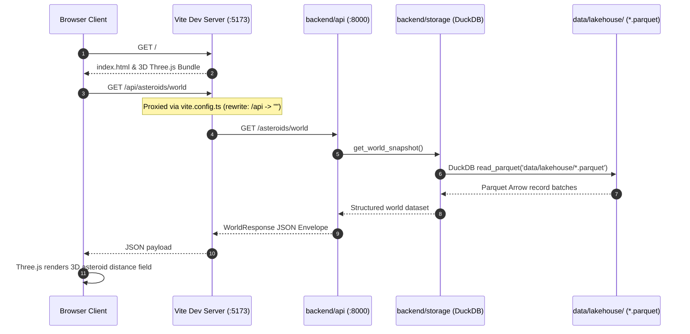

# APOLLO — Production Folder Structure Reorganization Plan
**NASA Near-Earth Object Intelligence Platform**

*Document Status: Draft / Plan for Review*  
*Constraint: Strict Zero-File-Deletion Policy (All existing assets, raw payloads, Parquet tables, tests, and configurations are preserved and relocated).*

---

## 1. Executive Summary & Objectives

The NASA Intelligence Platform (**APOLLO** — *Asteroid Proximity & Orbital Location, Linkage & Observation*) has evolved from an initial prototype into a multi-tier planetary defense intelligence system spanning:
1. **Multi-source Data Engineering Pipelines** (NASA NeoWs, JPL SBDB, JPL Sentry Mode S)
2. **Deterministic Entity Resolution & Data Quality Gates**
3. **Local DuckDB / Parquet Lakehouse & AWS Athena Warehouse**
4. **FastAPI Serving Layer** with strict Pydantic v2 schemas
5. **Three.js Immersive 3D Frontend & Distance World Renderer**
6. **Scheduled GitHub Actions Ingestion & Continuous Integration**
7. **Gemini & AI Agent Pair-Programming Configurations**

### Current Problem Statement
Currently, **88 files** reside directly in the workspace root directory. Core data engineering pipelines, DuckDB data access facades, Athena SQL scripts, SQLite databases, over 30 raw JSON payload files, 19 Parquet lakehouse tables, and 10 test suites are intermixed with project configuration files. 

This creates severe operational bottlenecks:
- **Namespace & Import Tangling:** Top-level modules (`nasa_asteroids`, `entity_resolution`, `dashboard_data`) pollute the global namespace and obscure boundaries between ingestion, storage, serving, and testing.
- **Data Pollution:** Generated lakehouse Parquet files and raw API JSON responses sit alongside tracked source code, making `.gitignore` brittle and raising the risk of accidental commits or deletions.
- **Obscured Subsystem Boundaries:** Data engineering pipelines, backend API, GitHub workflows, Gemini configurations, and the frontend need clean, segregated paths to support independent development, CI/CD, and scaling.

### Core Goals of This Reorganization
- **Clear Domain Segregation:** Create distinct, dedicated paths for **Backend Data Engineering**, **Backend API Serving**, **Lakehouse Data Storage**, **GitHub Workflows**, **Gemini / AI Agent Infrastructure**, **Frontend**, and **Test Suites**.
- **Zero File Deletion Guarantee:** Every existing file (all 34 `sbdb_raw_*.json` payloads, 19 Parquet snapshots, SQLite DB, CSV exports, test files, and SQL models) is safely mapped and relocated into structured storage zones.
- **Productionized Maintainability:** Provide standardized Python packaging (`pyproject.toml`), centralized environment configuration, clean path resolution (`APOLLO_DATA_DIR`), and streamlined GitHub Actions pipelines.

---

## 2. High-Level Architecture & Domain Segregation

### 2.1 Domain Segregation Diagram (Mermaid)



---

### 2.2 End-to-End Pipeline & Serving Flow (Mermaid)



---

## 3. Line Diagrams: Directory Trees (Before vs After)

### 3.1 Current State Line Diagram (As-Is: Polluted Root)

```text
c:\Users\saeed\OneDrive\Desktop\Nasa Intelligence Platform\
├── .env                                            [Config] Environment secrets
├── .env.example                                    [Config] Template secrets
├── .gitignore                                      [Git] Ignore rules
├── architecture.md                                 [Docs] Architectural spec
├── README.md                                       [Docs] Project guide
├── requirements.txt                                [Deps] Python dependencies
├── .gemini/                                        [Empty] Gemini folder
├── .github/
│   └── workflows/
│       ├── ci.yml                                  [CI] Quality gate workflow
│       └── scheduled_pipeline.yml                  [CI] Daily production pipeline
├── api/                                            [Serving] API Layer
│   ├── __init__.py
│   ├── main.py
│   ├── schemas.py
│   ├── service.py
│   └── routes/
│       ├── __init__.py
│       ├── asteroids.py
│       └── health.py
├── frontend/                                       [UI] Three.js Frontend
│   ├── package.json
│   ├── vite.config.ts
│   ├── tsconfig.json
│   ├── index.html
│   ├── src/
│   ├── test/
│   └── e2e/
│
│   ─── MIXED AT ROOT: 8 PYTHON PIPELINE & STORAGE SCRIPTS ───
├── nasa_asteroids.py                               [Pipeline] NeoWs ingestion
├── nasa_sbdb.py                                    [Pipeline] SBDB ingestion
├── nasa_sentry.py                                  [Pipeline] Sentry ingestion
├── pipeline_dq.py                                  [Pipeline] Data quality framework
├── pipeline_utils.py                               [Pipeline] Shared utilities
├── entity_resolution.py                            [Pipeline] Identity resolution
├── database.py                                     [Storage] SQLite loader
├── dashboard_data.py                               [Storage] DuckDB / Lakehouse facade
│
│   ─── MIXED AT ROOT: 10 BACKEND TEST SCRIPTS ───
├── test_api.py                                     [Test] API endpoint tests
├── test_data_provider.py                           [Test] DuckDB provider tests
├── test_entity_resolution.py                       [Test] Resolution logic tests
├── test_historical_risk.py                         [Test] Historical Sentry tests
├── test_intelligence_layer.py                      [Test] Athena intelligence views tests
├── test_nasa_asteroids.py                          [Test] NeoWs ingestion tests
├── test_nasa_sbdb.py                               [Test] SBDB ingestion tests
├── test_nasa_sentry.py                             [Test] Sentry ingestion tests
├── test_pipeline_dq.py                             [Test] DQ framework tests
├── test_pipeline_utils.py                          [Test] Utility function tests
│
│   ─── MIXED AT ROOT: 5 SQL WAREHOUSE SCRIPTS ───
├── schema.sql                                      [SQL] SQLite database schema
├── athena_schema.sql                               [SQL] AWS Athena DDL
├── athena_queries.sql                              [SQL] Analytical SQL queries
├── athena_intelligence_layer.sql                   [SQL] Athena intelligence views
├── athena_historical_risk.sql                      [SQL] Athena historical risk views
│
│   ─── MIXED AT ROOT: 19 PARQUET LAKEHOUSE TABLES ───
├── asteroids.parquet                               [Data] Curated NeoWs close approaches
├── bridge_asteroid_identifier.parquet              [Data] Crosswalk identifier bridge
├── fact_entity_resolution.parquet                  [Data] Crosswalk audit records
├── fact_sbdb_object_snapshot.parquet               [Data] Primary SBDB snapshot
├── fact_sbdb_object_snapshot_50548689.parquet      [Data] Single-target SBDB snapshot
├── fact_sbdb_object_snapshot_reference.parquet     [Data] Reference snapshot
├── fact_sbdb_orbit.parquet                         [Data] SBDB orbit parameters
├── fact_sbdb_orbit_50548689.parquet                [Data] Target orbit snapshot
├── fact_sbdb_orbit_element.parquet                 [Data] Keplerian elements
├── fact_sbdb_orbit_element_50548689.parquet         [Data] Target orbital elements
├── fact_sbdb_physical_parameter.parquet            [Data] Physical parameters
├── fact_sbdb_physical_parameter_50548689.parquet   [Data] Target physical parameters
├── fact_sentry_risk_snapshot.parquet               [Data] Sentry Mode S risk table
├── sbdb_object_3548666.parquet                     [Data] Target object parquet
├── sbdb_object_50427483.parquet                    [Data] Target object parquet
├── sbdb_object_50548689.parquet                    [Data] Target object parquet
├── sbdb_orbit_50548689.parquet                     [Data] Target orbit parquet
├── sbdb_orbit_element_50548689.parquet             [Data] Target element parquet
├── sbdb_physical_parameter_50548689.parquet        [Data] Target physical parquet
│
│   ─── MIXED AT ROOT: 38 RAW & REPORT JSON FILES ───
├── asteroids_raw.json                              [Data] Raw NeoWs API response
├── dq_result.json                                  [Data] Data quality gate report
├── neows_summary.json                              [Data] NeoWs ingestion summary
├── sbdb_batch_summary.json                         [Data] SBDB batch execution summary
├── sbdb_raw_20138971.json ... sbdb_raw_50872644.json [Data] 34 individual raw SBDB JSONs
│
│   ─── MIXED AT ROOT: 2 EXPORT / DATABASE FILES ───
├── asteroids.csv                                   [Data] 5-column inspection export
└── asteroids.db                                    [Data] SQLite inspection database
```

---

### 3.2 Proposed Productionized Line Diagram (To-Be: Modular Monorepo)

```text
c:\Users\saeed\OneDrive\Desktop\Nasa Intelligence Platform\
├── .env                                            # Local environment variables
├── .env.example                                    # Environment variable documentation
├── .gitignore                                      # Productionized ignore rules
├── architecture.md                                 # Architecture documentation (updated paths)
├── README.md                                       # Repository guide & onboarding
├── pyproject.toml                                  # Python project config, Ruff & Pytest settings
├── requirements.txt                                # Locked dependency specifications
│
├── .gemini/                                        # ─── GEMINI & AI AGENTIC SYSTEM ───
│   ├── README.md                                   # Gemini workspace guide
│   ├── config.json                                 # Agent runtime configurations
│   ├── rules/                                      # Operational guardrails & standards
│   │   ├── architectural_invariants.md             # Strict rules (tri-state, no synthetic scores)
│   │   ├── coding_standards.md                     # Python/TypeScript style & linting standards
│   │   └── data_engineering_standards.md           # PyArrow schemas, Snappy, S3 partitioning
│   └── prompts/                                    # Reusable operational prompt templates
│       ├── dq_failure_triage.md                    # Data quality alert diagnostic workflow
│       └── entity_crosswalk_audit.md               # Identity resolution audit prompts
│
├── .github/                                        # ─── GITHUB WORKFLOWS & AUTOMATION ───
│   ├── workflows/
│   │   ├── ci.yml                                  # Repository Quality Gate (Ruff + Pytest)
│   │   └── scheduled_pipeline.yml                  # Scheduled Ingestion, DQ & Publication
│   └── pull_request_template.md                    # PR checklist and standards
│
├── backend/                                        # ─── BACKEND PLATFORM CORE ───
│   ├── __init__.py
│   │
│   ├── pipelines/                                  # ── DATA ENGINEERING SUBSYSTEM ──
│   │   ├── __init__.py
│   │   ├── ingestion/                              # Source Ingestion Engines
│   │   │   ├── __init__.py
│   │   │   ├── nasa_asteroids.py                   # NASA NeoWs close approaches
│   │   │   ├── nasa_sbdb.py                        # JPL SBDB physical & orbital
│   │   │   └── nasa_sentry.py                      # JPL Sentry Mode S risk catalog
│   │   ├── resolution/                             # Multi-Source Entity Resolution
│   │   │   ├── __init__.py
│   │   │   └── entity_resolution.py                # Crosswalk matcher & bridge builder
│   │   ├── quality/                                # Data Quality & Gatekeeping
│   │   │   ├── __init__.py
│   │   │   └── pipeline_dq.py                      # Ingestion, output & crosswalk DQ gates
│   │   └── utils/                                  # Shared Pipeline Utilities
│   │       ├── __init__.py
│   │       └── pipeline_utils.py                   # HTTP client, PyArrow, S3, redaction
│   │
│   ├── storage/                                    # ── LAKEHOUSE & DATA ACCESS ──
│   │   ├── __init__.py
│   │   ├── dashboard_data.py                       # DuckDB in-memory lakehouse query facade
│   │   └── database.py                             # SQLite persistence adapter
│   │
│   ├── sql/                                        # ── SQL WAREHOUSE SCHEMAS & VIEWS ──
│   │   ├── schema.sql                              # SQLite DDL schema
│   │   ├── athena_schema.sql                       # AWS Athena Lakehouse DDL
│   │   ├── athena_queries.sql                      # Analytical & forensic queries
│   │   ├── athena_intelligence_layer.sql           # SBDB & Sentry intelligence views
│   │   └── athena_historical_risk.sql              # Sentry historical risk lifecycle views
│   │
│   └── api/                                        # ── FASTAPI SERVING SUBSYSTEM ──
│       ├── __init__.py
│       ├── main.py                                 # FastAPI factory & lakehouse fallback
│       ├── schemas.py                              # Pydantic v2 schemas (extra="forbid")
│       ├── service.py                              # Business logic & readiness probes
│       └── routes/
│           ├── __init__.py
│           ├── asteroids.py                        # Watchlist, world, profile endpoints
│           └── health.py                           # Storage readiness & DuckDB probes
│
├── data/                                           # ─── DATA LAKEHOUSE ZONES (ZERO DELETION) ───
│   ├── .gitkeep
│   ├── raw/                                        # Raw JSON Payloads (Lineage / Replay)
│   │   ├── neows/
│   │   │   └── asteroids_raw.json                  # Preserved raw NeoWs payload
│   │   ├── sbdb/
│   │   │   ├── sbdb_raw_20138971.json              # Preserved SBDB target payloads (34 files)
│   │   │   └── ... (all 34 target JSONs)
│   │   └── sentry/
│   │       └── .gitkeep                            # Dedicated zone for raw Sentry snapshots
│   │
│   ├── lakehouse/                                  # Curated Snappy Parquet Datasets (19 files)
│   │   ├── asteroids.parquet                       # Curated NeoWs encounters
│   │   ├── bridge_asteroid_identifier.parquet      # Deterministic crosswalk bridge
│   │   ├── fact_entity_resolution.parquet          # Entity resolution audit facts
│   │   ├── fact_sbdb_object_snapshot.parquet       # SBDB astronomical objects
│   │   ├── fact_sbdb_orbit.parquet                 # SBDB orbital solutions
│   │   ├── fact_sbdb_orbit_element.parquet         # SBDB Keplerian elements
│   │   ├── fact_sbdb_physical_parameter.parquet    # SBDB physical parameters
│   │   ├── fact_sentry_risk_snapshot.parquet       # Sentry Mode S risk catalog
│   │   └── ... (all single-target fact parquets)
│   │
│   ├── exports/                                    # Local Inspection Exports
│   │   ├── asteroids.csv                           # Preserved CSV export
│   │   └── asteroids.db                            # Preserved SQLite database file
│   │
│   └── reports/                                    # Execution Summaries & DQ Diagnostics
│       ├── dq_result.json                          # Preserved DQ gate validation result
│       ├── neows_summary.json                      # Preserved NeoWs ingestion summary
│       └── sbdb_batch_summary.json                 # Preserved SBDB batch summary
│
├── tests/                                          # ─── CENTRALIZED TEST SUITE ───
│   ├── __init__.py
│   ├── conftest.py                                 # Shared pytest fixtures & test data paths
│   ├── unit/                                       # Unit Tests
│   │   ├── __init__.py
│   │   ├── test_pipeline_utils.py                  # HTTP client, redaction, PyArrow tests
│   │   └── test_pipeline_dq.py                     # Data quality rule verification tests
│   ├── integration/                                # Integration Tests
│   │   ├── __init__.py
│   │   ├── test_nasa_asteroids.py                  # NeoWs ingestion & schema tests
│   │   ├── test_nasa_sbdb.py                       # SBDB batch fetch & mapping tests
│   │   ├── test_nasa_sentry.py                     # Sentry risk snapshot tests
│   │   ├── test_entity_resolution.py               # Deterministic crosswalk tests
│   │   ├── test_data_provider.py                   # DuckDB local data provider tests
│   │   ├── test_historical_risk.py                 # Historical risk SQL tests
│   │   └── test_intelligence_layer.py              # Intelligence layer SQL tests
│   └── api/                                        # API Serving Tests
│       ├── __init__.py
│       └── test_api.py                             # FastAPI endpoints & contracts tests
│
└── frontend/                                       # ─── 3D RENDERER & WEB CLIENT ───
    ├── package.json                                # Node.js dependencies
    ├── vite.config.ts                              # Vite dev server & /api proxy
    ├── tsconfig.json                               # TypeScript configuration
    ├── index.html                                  # Web application entry point
    ├── README.md                                   # Frontend documentation
    ├── src/                                        # TypeScript Application Source
    │   ├── main.ts & app.ts                        # Application bootstrap & lifecycle
    │   ├── config.ts                               # Frontend configuration
    │   ├── api/                                    # HTTP client & schema guards
    │   ├── renderer/                               # Three.js 3D WorldRenderer
    │   ├── scene/                                  # Atmosphere, sky, reveal logic
    │   ├── ui/                                     # HUD, Callouts, Tooltips, Styles
    │   ├── state/                                  # Reactive state store & router
    │   └── models/                                 # Domain interfaces (World & Profile)
    ├── test/                                       # Vitest Unit Tests & Fixtures
    └── e2e/                                        # Playwright E2E Tests & Artifacts
```

---

## 4. Comprehensive File-by-File Relocation Inventory (100% Accounted For)

Every single file in the workspace has a distinct, safe destination. **Zero files are deleted.**

| # | Existing Path (Root) | Proposed New Destination | Domain / Pillar | Purpose & Handling |
|---|---|---|---|---|
| **Configurations & Tooling** |
| 1 | `.env` | `.env` | Root Config | Unchanged (local credentials) |
| 2 | `.env.example` | `.env.example` | Root Config | Unchanged (template) |
| 3 | `.gitignore` | `.gitignore` | Root Config | Updated to ignore `data/lakehouse/*.parquet`, etc. |
| 4 | `requirements.txt` | `requirements.txt` | Root Config | Updated to include package install |
| 5 | `architecture.md` | `architecture.md` | Root Docs | Updated to reflect new directory structure |
| 6 | `README.md` | `README.md` | Root Docs | Updated developer onboarding instructions |
| **Backend Data Engineering Pipelines** |
| 7 | `nasa_asteroids.py` | `backend/pipelines/ingestion/nasa_asteroids.py` | Data Engineering | NeoWs close-approach ingestion |
| 8 | `nasa_sbdb.py` | `backend/pipelines/ingestion/nasa_sbdb.py` | Data Engineering | JPL SBDB orbital & physical ingestion |
| 9 | `nasa_sentry.py` | `backend/pipelines/ingestion/nasa_sentry.py` | Data Engineering | JPL Sentry Mode S risk ingestion |
| 10 | `entity_resolution.py` | `backend/pipelines/resolution/entity_resolution.py` | Data Engineering | Crosswalk matching & UUID5 bridge |
| 11 | `pipeline_dq.py` | `backend/pipelines/quality/pipeline_dq.py` | Data Engineering | Data quality gatekeeper & suite |
| 12 | `pipeline_utils.py` | `backend/pipelines/utils/pipeline_utils.py` | Data Engineering | HTTP, S3, PyArrow, redaction helpers |
| **Backend Storage & Data Access** |
| 13 | `dashboard_data.py` | `backend/storage/dashboard_data.py` | Storage / Lakehouse | DuckDB Parquet query facade |
| 14 | `database.py` | `backend/storage/database.py` | Storage / SQLite | SQLite database loader |
| **SQL Warehouse Schemas & Analytics** |
| 15 | `schema.sql` | `backend/sql/schema.sql` | Warehouse / DDL | SQLite table schema |
| 16 | `athena_schema.sql` | `backend/sql/athena_schema.sql` | Warehouse / DDL | Athena external table DDL |
| 17 | `athena_queries.sql` | `backend/sql/athena_queries.sql` | Warehouse / SQL | Analytical audit queries |
| 18 | `athena_intelligence_layer.sql`| `backend/sql/athena_intelligence_layer.sql` | Warehouse / SQL | Crosswalk & characterization views |
| 19 | `athena_historical_risk.sql` | `backend/sql/athena_historical_risk.sql` | Warehouse / SQL | Sentry historical risk views |
| **Backend API Serving Layer** |
| 20 | `api/main.py` | `backend/api/main.py` | API Serving | FastAPI factory & entry point |
| 21 | `api/schemas.py` | `backend/api/schemas.py` | API Serving | Pydantic v2 schemas |
| 22 | `api/service.py` | `backend/api/service.py` | API Serving | Service layer & readiness checks |
| 23 | `api/__init__.py` | `backend/api/__init__.py` | API Serving | Package initializer |
| 24 | `api/routes/asteroids.py` | `backend/api/routes/asteroids.py` | API Serving | Asteroid endpoints router |
| 25 | `api/routes/health.py` | `backend/api/routes/health.py` | API Serving | Health & readiness router |
| 26 | `api/routes/__init__.py` | `backend/api/routes/__init__.py` | API Serving | Package initializer |
| **Centralized Test Suites** |
| 27 | `test_pipeline_utils.py` | `tests/unit/test_pipeline_utils.py` | Testing (Unit) | Utility unit tests |
| 28 | `test_pipeline_dq.py` | `tests/unit/test_pipeline_dq.py` | Testing (Unit) | DQ framework unit tests |
| 29 | `test_nasa_asteroids.py` | `tests/integration/test_nasa_asteroids.py` | Testing (Integration) | NeoWs pipeline tests |
| 30 | `test_nasa_sbdb.py` | `tests/integration/test_nasa_sbdb.py` | Testing (Integration) | SBDB pipeline tests |
| 31 | `test_nasa_sentry.py` | `tests/integration/test_nasa_sentry.py` | Testing (Integration) | Sentry pipeline tests |
| 32 | `test_entity_resolution.py` | `tests/integration/test_entity_resolution.py`| Testing (Integration) | Crosswalk tests |
| 33 | `test_data_provider.py` | `tests/integration/test_data_provider.py` | Testing (Integration) | DuckDB data provider tests |
| 34 | `test_historical_risk.py` | `tests/integration/test_historical_risk.py` | Testing (Integration) | Athena historical risk tests |
| 35 | `test_intelligence_layer.py` | `tests/integration/test_intelligence_layer.py`| Testing (Integration) | Athena intelligence views tests |
| 36 | `test_api.py` | `tests/api/test_api.py` | Testing (API) | FastAPI integration tests |
| **Data Lakehouse Storage — Curated Parquet (Preserved)** |
| 37 | `asteroids.parquet` | `data/lakehouse/asteroids.parquet` | Lakehouse Zone | Curated NeoWs close approaches |
| 38 | `bridge_asteroid_identifier.parquet`| `data/lakehouse/bridge_asteroid_identifier.parquet`| Lakehouse Zone | Crosswalk identifier bridge |
| 39 | `fact_entity_resolution.parquet` | `data/lakehouse/fact_entity_resolution.parquet` | Lakehouse Zone | Crosswalk audit records |
| 40 | `fact_sbdb_object_snapshot.parquet` | `data/lakehouse/fact_sbdb_object_snapshot.parquet` | Lakehouse Zone | Primary SBDB snapshot |
| 41 | `fact_sbdb_object_snapshot_50548689.parquet` | `data/lakehouse/fact_sbdb_object_snapshot_50548689.parquet` | Lakehouse Zone | Single-target SBDB snapshot |
| 42 | `fact_sbdb_object_snapshot_reference.parquet` | `data/lakehouse/fact_sbdb_object_snapshot_reference.parquet` | Lakehouse Zone | Reference SBDB snapshot |
| 43 | `fact_sbdb_orbit.parquet` | `data/lakehouse/fact_sbdb_orbit.parquet` | Lakehouse Zone | Curated SBDB orbit elements |
| 44 | `fact_sbdb_orbit_50548689.parquet` | `data/lakehouse/fact_sbdb_orbit_50548689.parquet` | Lakehouse Zone | Target orbit snapshot |
| 45 | `fact_sbdb_orbit_element.parquet` | `data/lakehouse/fact_sbdb_orbit_element.parquet` | Lakehouse Zone | Curated orbital elements |
| 46 | `fact_sbdb_orbit_element_50548689.parquet` | `data/lakehouse/fact_sbdb_orbit_element_50548689.parquet` | Lakehouse Zone | Target orbital elements |
| 47 | `fact_sbdb_physical_parameter.parquet` | `data/lakehouse/fact_sbdb_physical_parameter.parquet` | Lakehouse Zone | Curated physical parameters |
| 48 | `fact_sbdb_physical_parameter_50548689.parquet`| `data/lakehouse/fact_sbdb_physical_parameter_50548689.parquet`| Lakehouse Zone | Target physical parameters |
| 49 | `fact_sentry_risk_snapshot.parquet` | `data/lakehouse/fact_sentry_risk_snapshot.parquet` | Lakehouse Zone | Curated Sentry Mode S risk table |
| 50 | `sbdb_object_3548666.parquet` | `data/lakehouse/sbdb_object_3548666.parquet` | Lakehouse Zone | Target object parquet |
| 51 | `sbdb_object_50427483.parquet` | `data/lakehouse/sbdb_object_50427483.parquet` | Lakehouse Zone | Target object parquet |
| 52 | `sbdb_object_50548689.parquet` | `data/lakehouse/sbdb_object_50548689.parquet` | Lakehouse Zone | Target object parquet |
| 53 | `sbdb_orbit_50548689.parquet` | `data/lakehouse/sbdb_orbit_50548689.parquet` | Lakehouse Zone | Target orbit parquet |
| 54 | `sbdb_orbit_element_50548689.parquet` | `data/lakehouse/sbdb_orbit_element_50548689.parquet` | Lakehouse Zone | Target element parquet |
| 55 | `sbdb_physical_parameter_50548689.parquet` | `data/lakehouse/sbdb_physical_parameter_50548689.parquet` | Lakehouse Zone | Target physical parquet |
| **Data Lakehouse Storage — Raw Payloads (Preserved)** |
| 56 | `asteroids_raw.json` | `data/raw/neows/asteroids_raw.json` | Raw Data Zone | Raw NeoWs API response |
| 57–90 | `sbdb_raw_20138971.json` through `sbdb_raw_50872644.json` (34 files) | `data/raw/sbdb/sbdb_raw_*.json` (34 files) | Raw Data Zone | Raw JPL SBDB API responses |
| **Data Lakehouse Storage — Exports & Reports (Preserved)** |
| 91 | `asteroids.csv` | `data/exports/asteroids.csv` | Export Zone | 5-column inspection export |
| 92 | `asteroids.db` | `data/exports/asteroids.db` | Export Zone | SQLite inspection database |
| 93 | `dq_result.json` | `data/reports/dq_result.json` | Report Zone | DQ validation run results |
| 94 | `neows_summary.json` | `data/reports/neows_summary.json` | Report Zone | NeoWs ingestion summary |
| 95 | `sbdb_batch_summary.json` | `data/reports/sbdb_batch_summary.json` | Report Zone | SBDB batch summary |
| **GitHub Workflows & Automation** |
| 96 | `.github/workflows/ci.yml` | `.github/workflows/ci.yml` | GitHub Workflows | Updated test discovery paths |
| 97 | `.github/workflows/scheduled_pipeline.yml` | `.github/workflows/scheduled_pipeline.yml` | GitHub Workflows | Updated pipeline script execution paths |
| **Frontend Application** |
| 98 | `frontend/` (all contents) | `frontend/` (retained & elevated) | Frontend UI | Decoupled Three.js client |
| **Gemini AI Agent System** |
| 99 | `.gemini/` | `.gemini/` (structured & enhanced) | AI Agent Infrastructure | Rules, prompts, and agent config |

---

## 5. Subsystem Deep-Dives

### 5.1 Pillar 1: Backend Data Engineering Path (`backend/pipelines/`)

The data engineering pipelines are organized strictly by functional stage, establishing clear data lifecycle boundaries:



#### Key Technical Upgrades for Pipelines:
1. **Configurable Output Directory (`APOLLO_DATA_DIR`):**  
   Every script (`nasa_asteroids.py`, `nasa_sbdb.py`, `nasa_sentry.py`, `entity_resolution.py`, `pipeline_dq.py`) should use a shared helper `get_data_dir()` resolving from `os.getenv("APOLLO_DATA_DIR", "<project_root>/data")`.
2. **Standardized Sub-paths:**
   - Raw JSONs written to `data/raw/{source}/`
   - Parquet lakehouse tables written to `data/lakehouse/`
   - Reports and manifests written to `data/reports/`
3. **Module Imports:**
   Pipeline scripts import utilities cleanly via package references:
   ```python
   from backend.pipelines.utils.pipeline_utils import write_parquet, upload_file_to_s3
   from backend.pipelines.quality.pipeline_dq import run_suite
   ```

---

### 5.2 Pillar 2: Lakehouse & Storage Architecture (`data/` & `backend/storage/`)

The lakehouse follows a modernized Medallion-like design tailored for planetary defense data:



#### Path Resolution in `dashboard_data.py`:
In the current implementation:
```python
if base_dir is None:
    self.base_dir = Path(__file__).resolve().parent
```
In the new productionized layout, `dashboard_data.py` sits in `backend/storage/`. It will resolve `data/lakehouse/` gracefully:
```python
def resolve_lakehouse_dir(base_dir: Path | str | None = None) -> Path:
    if base_dir is not None:
        return Path(base_dir).resolve()
    env_dir = os.getenv("APOLLO_LAKEHOUSE_DIR")
    if env_dir:
        return Path(env_dir).resolve()
    # Default to data/lakehouse relative to repo root
    project_root = Path(__file__).resolve().parent.parent.parent
    lakehouse_dir = project_root / "data" / "lakehouse"
    if lakehouse_dir.exists():
        return lakehouse_dir
    return project_root
```

---

### 5.3 Pillar 3: GitHub Workflows & CI/CD (`.github/`)

The automation path coordinates testing and daily pipelines. Reorganizing files requires minimal, precise updates to `.github/workflows/`:



#### Specific Workflow Updates Required:
1. **`ci.yml`**:
   - `ruff check .` updated to `ruff check backend/ tests/`
   - `pytest -v` automatically discovers `tests/` via `pyproject.toml`
2. **`scheduled_pipeline.yml`**:
   - Update python invocation commands to module syntax:
     - `python backend/pipelines/ingestion/nasa_asteroids.py` (or `python -m backend.pipelines.ingestion.nasa_asteroids`)
     - `python backend/pipelines/ingestion/nasa_sentry.py`
     - `python backend/pipelines/ingestion/nasa_sbdb.py`
     - `python backend/pipelines/resolution/entity_resolution.py`
     - `python backend/pipelines/quality/pipeline_dq.py`
   - Artifact cleanup step points to `data/lakehouse/` and `data/reports/`.

---

### 5.4 Pillar 4: Gemini & AI Agent Infrastructure (`.gemini/`)

To transform `.gemini/` from an empty directory into a productionized AI pair-programming infrastructure:



#### Proposed Files for `.gemini/`:
1. **`.gemini/README.md`**: Explains how Gemini agent context and rules are discovered and applied.
2. **`.gemini/rules/architectural_invariants.md`**: Encodes the locked APOLLO invariants (No synthetic risk scoring, PHA is not Sentry, Unknown is not false).
3. **`.gemini/rules/coding_standards.md`**: Formatting, typing, and test standards.
4. **`.gemini/prompts/dq_failure_triage.md`**: Standard diagnosis prompts when GitHub Actions scheduled pipelines encounter exit code 1.

---

### 5.5 Pillar 5: Frontend Directory (`frontend/`)

The frontend is already well-structured as an independent TypeScript / Vite application. Its relationship with the reorganized backend remains completely decoupled:



- **Zero Breaking Changes for Frontend:** The frontend continues to communicate with the FastAPI server via `/api` proxy. Reorganizing backend files into `backend/api/` does not change HTTP routes or port bindings.

---

### 5.6 Pillar 6: Centralized Test Suite (`tests/`)

Moving root tests into `tests/` cleanly distinguishes unit tests from integration tests and API contract tests:

```text
tests/
├── __init__.py
├── conftest.py                             # Master pytest fixtures: mock lakehouse, temp dirs
├── unit/
│   ├── __init__.py
│   ├── test_pipeline_utils.py              # Test redaction, S3 URL parsing, PyArrow helpers
│   └── test_pipeline_dq.py                 # Test DQ checks and thresholds
├── integration/
│   ├── __init__.py
│   ├── test_nasa_asteroids.py              # Ingestion schema & NeoWs parser tests
│   ├── test_nasa_sbdb.py                   # SBDB batch fetch & mapping tests
│   ├── test_nasa_sentry.py                 # Sentry parser & point-in-time snapshot tests
│   ├── test_entity_resolution.py           # Crosswalk determinism & UUID5 checks
│   ├── test_data_provider.py               # LocalDuckDBDataProvider query tests
│   ├── test_historical_risk.py             # Sentry historical risk views tests
│   └── test_intelligence_layer.py          # Athena views tests
└── api/
    ├── __init__.py
    └── test_api.py                         # FastAPI routes, schemas, health probe tests
```

---

## 6. Migration & Compatibility Strategy

To ensure zero downtime, non-breaking developer workflows, and immediate CI green-status:

### 6.1 Python Import Resolution (`pyproject.toml`)
Create a root `pyproject.toml` that designates `backend` and `.` as source roots, and configures `pytest` and `ruff`:

```toml
[build-system]
requires = ["setuptools>=61.0"]
build-backend = "setuptools.build_meta"

[project]
name = "apollo-planetary-defense"
version = "1.0.0"
description = "NASA Asteroid Proximity & Orbital Location, Linkage & Observation Platform"
readme = "README.md"
requires-python = ">=3.11"
dependencies = [
    "requests>=2.31.0",
    "boto3>=1.34.0",
    "python-dotenv>=1.0.0",
    "pytest>=8.0.0",
    "pyarrow>=15.0.0",
    "pandas>=2.0.0",
    "ruff==0.15.2",
    "duckdb>=1.0.0",
    "fastapi>=0.109.0",
    "uvicorn>=0.27.0",
    "httpx>=0.27.0",
]

[tool.setuptools.packages.find]
where = ["."]
include = ["backend*", "api*"]

[tool.pytest.ini_options]
minversion = "8.0"
testpaths = ["tests"]
pythonpath = [".", "backend"]
python_files = ["test_*.py"]

[tool.ruff]
line-length = 100
target-version = "py311"
exclude = [".git", "__pycache__", "frontend", "data"]
```

### 6.2 Backward Compatibility Root Shims (Optional Transition Layer)
During the transition phase, lightweight root wrapper scripts can be left in place or aliased so that existing developer muscle memory (`python test_api.py` or `python nasa_asteroids.py`) continues to work seamlessly:
```python
# Optional backward-compatible shim in root (if desired):
# nasa_asteroids.py
from backend.pipelines.ingestion.nasa_asteroids import main, ASTEROID_SCHEMA
if __name__ == "__main__":
    import sys
    sys.exit(main())
```

---

## 7. Phased Implementation Roadmap

```mermaid
gantt
    title Folder Structure Reorganization Execution Timeline
    dateFormat  X
    axisFormat  Day %d

    section Phase 1: Prep & Scaffolding
    Directory Tree Scaffolding           :p1_1, 0, 1
    pyproject.toml & config creation    :p1_2, 0, 1

    section Phase 2: Data Relocation
    Preserve & Relocate Raw JSONs (34+) :p2_1, 1, 2
    Preserve & Relocate Parquet (19)    :p2_2, 1, 2
    Preserve CSV, SQLite DB, Reports    :p2_3, 1, 2

    section Phase 3: SQL & Warehouse
    Relocate Athena & SQLite SQL files  :p3_1, 2, 3

    section Phase 4: Backend Modularization
    Relocate Ingestion & DQ Pipelines   :p4_1, 3, 4
    Relocate Storage & Data Provider    :p4_2, 3, 4
    Relocate API Serving Layer          :p4_3, 3, 4
    Update Path References              :p4_4, 4, 5

    section Phase 5: Test Suite Segregation
    Relocate Tests to tests/            :p5_1, 5, 6
    Create conftest.py & Verify Pytest  :p5_2, 5, 6

    section Phase 6: Gemini & Workflows
    Populate .gemini rules & prompts    :p6_1, 6, 7
    Update .github/workflows            :p6_2, 6, 7

    section Phase 7: Verification
    Run Full Test Suite & E2E Validation:p7_1, 7, 8
```



### Phase 1: Directory Scaffolding & Configuration
Create the target directory tree without moving any files yet:
```powershell
# PowerShell scaffolding script
New-Item -ItemType Directory -Force -Path "backend/pipelines/ingestion"
New-Item -ItemType Directory -Force -Path "backend/pipelines/resolution"
New-Item -ItemType Directory -Force -Path "backend/pipelines/quality"
New-Item -ItemType Directory -Force -Path "backend/pipelines/utils"
New-Item -ItemType Directory -Force -Path "backend/storage"
New-Item -ItemType Directory -Force -Path "backend/sql"
New-Item -ItemType Directory -Force -Path "backend/api"
New-Item -ItemType Directory -Force -Path "data/raw/neows"
New-Item -ItemType Directory -Force -Path "data/raw/sbdb"
New-Item -ItemType Directory -Force -Path "data/raw/sentry"
New-Item -ItemType Directory -Force -Path "data/lakehouse"
New-Item -ItemType Directory -Force -Path "data/exports"
New-Item -ItemType Directory -Force -Path "data/reports"
New-Item -ItemType Directory -Force -Path "tests/unit"
New-Item -ItemType Directory -Force -Path "tests/integration"
New-Item -ItemType Directory -Force -Path "tests/api"
New-Item -ItemType Directory -Force -Path ".gemini/rules"
New-Item -ItemType Directory -Force -Path ".gemini/prompts"
```

### Phase 2: Data Zone Segregation (Zero-Deletion File Movement)
Safely move all data assets from root to `data/`:
```powershell
# 1. Raw JSON payloads
Move-Item -Path "asteroids_raw.json" -Destination "data/raw/neows/" -Force
Move-Item -Path "sbdb_raw_*.json" -Destination "data/raw/sbdb/" -Force

# 2. Curated Lakehouse Parquet Tables
Move-Item -Path "*.parquet" -Destination "data/lakehouse/" -Force

# 3. Exports & Database
Move-Item -Path "asteroids.csv" -Destination "data/exports/" -Force
Move-Item -Path "asteroids.db" -Destination "data/exports/" -Force

# 4. Reports & Summaries
Move-Item -Path "dq_result.json" -Destination "data/reports/" -Force
Move-Item -Path "neows_summary.json" -Destination "data/reports/" -Force
Move-Item -Path "sbdb_batch_summary.json" -Destination "data/reports/" -Force
```

### Phase 3: SQL Warehouse Relocation
Move all SQL files into `backend/sql/`:
```powershell
Move-Item -Path "schema.sql" -Destination "backend/sql/" -Force
Move-Item -Path "athena_*.sql" -Destination "backend/sql/" -Force
```

### Phase 4: Backend Pipelines & Storage Relocation
Relocate Python pipeline and storage modules:
```powershell
# Pipelines
Move-Item -Path "nasa_asteroids.py" -Destination "backend/pipelines/ingestion/" -Force
Move-Item -Path "nasa_sbdb.py" -Destination "backend/pipelines/ingestion/" -Force
Move-Item -Path "nasa_sentry.py" -Destination "backend/pipelines/ingestion/" -Force
Move-Item -Path "entity_resolution.py" -Destination "backend/pipelines/resolution/" -Force
Move-Item -Path "pipeline_dq.py" -Destination "backend/pipelines/quality/" -Force
Move-Item -Path "pipeline_utils.py" -Destination "backend/pipelines/utils/" -Force

# Storage & Data Access
Move-Item -Path "dashboard_data.py" -Destination "backend/storage/" -Force
Move-Item -Path "database.py" -Destination "backend/storage/" -Force

# API Serving (Move entire api directory under backend/api)
Copy-Item -Path "api/*" -Destination "backend/api/" -Recurse -Force
```

### Phase 5: Test Suite Segregation
Move all root `test_*.py` files into organized test folders:
```powershell
# Unit tests
Move-Item -Path "test_pipeline_utils.py" -Destination "tests/unit/" -Force
Move-Item -Path "test_pipeline_dq.py" -Destination "tests/unit/" -Force

# Integration tests
Move-Item -Path "test_nasa_asteroids.py" -Destination "tests/integration/" -Force
Move-Item -Path "test_nasa_sbdb.py" -Destination "tests/integration/" -Force
Move-Item -Path "test_nasa_sentry.py" -Destination "tests/integration/" -Force
Move-Item -Path "test_entity_resolution.py" -Destination "tests/integration/" -Force
Move-Item -Path "test_data_provider.py" -Destination "tests/integration/" -Force
Move-Item -Path "test_historical_risk.py" -Destination "tests/integration/" -Force
Move-Item -Path "test_intelligence_layer.py" -Destination "tests/integration/" -Force

# API tests
Move-Item -Path "test_api.py" -Destination "tests/api/" -Force
```

### Phase 6: GitHub Workflows & Gemini Setup
1. Update `.github/workflows/ci.yml` and `scheduled_pipeline.yml`.
2. Add `.gemini/rules/architectural_invariants.md`, `coding_standards.md`, and `README.md`.
3. Update `.gitignore` to track empty folder structures with `.gitkeep` while ignoring dynamic lakehouse contents.

---

## 8. Verification & Validation Protocol

After the reorganization is executed, the following automated validation protocol ensures 100% operational readiness:

### 1. Test Suite Verification
```bash
# Run entire test suite across new test locations
pytest -v
```
*Expected Result:* All tests pass, discovering unit, integration, and API tests from `tests/`.

### 2. Linter & Formatting Check
```bash
# Verify Ruff across restructured packages
ruff check backend/ tests/
```
*Expected Result:* Zero linting violations.

### 3. API Health & Serving Probe
```bash
# Start FastAPI server on test port
uvicorn backend.api.main:app --port 8000 &
curl -s http://127.0.0.1:8000/health
```
*Expected Result:* HTTP 200 with JSON payload reporting DuckDB engine and lakehouse readiness.

### 4. Frontend Integration Check
```bash
cd frontend
npm test
npm run build
```
*Expected Result:* Frontend builds cleanly with zero errors; Vitest unit tests pass.

### 5. Data Completeness Verification
```powershell
# Verify no files were deleted
(Get-ChildItem -Recurse data/raw/sbdb/*.json).Count  # Must equal 34
(Get-ChildItem -Recurse data/lakehouse/*.parquet).Count  # Must equal 19
```
*Expected Result:* Exact count of raw JSONs (34 SBDB + 1 NeoWs) and Parquets (19) matches original counts.

---

## 9. Rollback & Safety Plan

To prevent any possibility of data or code loss:
1. **Git Checkpoint:** Before executing any move command, commit or stash the current branch:
   ```bash
   git add -A
   git commit -m "checkpoint: pre-folder-reorganization state"
   git tag pre-reorg-backup
   ```
2. **Atomic Movement:** Movements are strictly file-to-file moves (`Move-Item` / `mv`). No `rm` or `Remove-Item` commands are executed on data assets or code.
3. **Instant Rollback:** If any issue arises, restore the state instantly:
   ```bash
   git checkout pre-reorg-backup
   ```

---

## 10. Production Deployment Blueprint: Vercel (Frontend) & Render (Backend) Free Tiers

This section defines the zero-cost production deployment architecture using **Vercel** for the 3D client and **Render** for the FastAPI serving layer.

### 10.1 Free Tier Deployment Architecture (Mermaid)

```mermaid
graph TB
    subgraph Users["End Users / Web Browsers"]
        CLIENT["Browser Client (Three.js 3D Canvas)"]
    end

    subgraph VercelEdge["Vercel Global Edge Network (100% Free)"]
        V_CDN["Vercel Edge CDN<br/><code>*.vercel.app</code>"]
        V_SPA["Static Assets & JS Bundle<br/><code>dist/ (index.html, Three.js)</code>"]
        V_CONF["<code>vercel.json</code> SPA Rewrites & Proxy"]
    end

    subgraph RenderPaaS["Render Cloud Platform (Free Web Service)"]
        R_PROXY["Render Ingress & SSL Termination<br/><code>https://apollo-api-xxxx.onrender.com</code>"]
        R_FASTAPI["FastAPI Serving Process (Uvicorn)<br/>Port: $PORT | Memory: < 512MB"]
        R_CORS["CORSMiddleware (Allowed Origins)"]
        R_DUCK["In-Memory DuckDB Engine"]
        R_LAKE["Bundled Lakehouse Parquets<br/><code>data/lakehouse/*.parquet</code>"]
    end

    subgraph GitHubAutomation["GitHub Repository & CI/CD"]
        REPO["Git Repository (Main Branch)"]
        GHA_CRON["Scheduled Ingestion (.github/workflows)"]
    end

    REPO -->|Git Push Auto-Deploy| VercelEdge
    REPO -->|Git Push Auto-Deploy| RenderPaaS
    GHA_CRON -->|Daily Ingestion & S3 Sync| RenderPaaS

    CLIENT -->|1. Load HTML/CSS/JS (HTTPS)| V_CDN
    V_CDN --> V_SPA
    CLIENT -->|2. GET /asteroids/world & /profile (CORS HTTPS)| R_PROXY
    R_PROXY --> R_CORS --> R_FASTAPI
    R_FASTAPI --> R_DUCK --> R_LAKE
```

---

### 10.2 Render Free Tier Backend Configuration

Render’s Free Web Service provides:
- **0.1 vCPU & 512 MB RAM** (Plenty of headroom: FastAPI + DuckDB parquet queries consume ~40–70MB RAM).
- **Free automated TLS/SSL certificate** (`https://<service-name>.onrender.com`).
- **Git Push Deploys**: Render automatically rebuilds and deploys when code is pushed to `main`.
- **Note on Sleep Behavior:** The free tier spins down to sleep after 15 minutes of inactivity. When a new request arrives, it spins up in ~30–50 seconds.

#### 1. Infrastructure-as-Code: `render.yaml`
Add `render.yaml` to the project root for 1-click Blueprint deployment:

```yaml
services:
  - type: web
    name: apollo-planetary-api
    runtime: python
    plan: free
    region: oregon
    buildCommand: "pip install --upgrade pip && pip install -r requirements.txt"
    startCommand: "uvicorn backend.api.main:app --host 0.0.0.0 --port $PORT"
    healthCheckPath: /health
    envVars:
      - key: PYTHON_VERSION
        value: 3.11.9
      - key: CORS_ORIGINS
        value: "https://*.vercel.app,http://localhost:5173"
      - key: APOLLO_LAKEHOUSE_DIR
        value: "data/lakehouse"
```

#### 2. FastAPI CORS Middleware Requirement
To allow the Vercel frontend to query the Render API without cross-origin browser blocking, add `CORSMiddleware` in `backend/api/main.py`:

```python
import os
from fastapi.middleware.cors import CORSMiddleware

def create_app(provider: DashboardDataProvider | None = None) -> FastAPI:
    application = FastAPI(
        title="NASA Planetary Defense Platform API",
        version="1.0.0",
    )

    allowed_origins = os.getenv("CORS_ORIGINS", "*").split(",")

    application.add_middleware(
        CORSMiddleware,
        allow_origins=allowed_origins if allowed_origins != ["*"] else ["*"],
        allow_credentials=True,
        allow_methods=["GET", "OPTIONS"],
        allow_headers=["*"],
    )
    ...
```

---

### 10.3 Vercel Free Tier Frontend Configuration

Vercel provides zero-cost hosting for Single Page Applications (SPAs) with automatic branch previews and global edge caching.

#### 1. Vercel Project Settings
When importing your repository in Vercel:
- **Framework Preset:** `Vite`
- **Root Directory:** `frontend`
- **Build Command:** `npm run build`
- **Output Directory:** `dist`
- **Environment Variables:**
  - `VITE_API_BASE_URL`: `https://apollo-planetary-api.onrender.com` (your Render URL)

#### 2. Single Page Application Routing: `frontend/vercel.json`
To ensure page reloads don't return 404s, add `frontend/vercel.json`:

```json
{
  "rewrites": [
    {
      "source": "/(.*)",
      "destination": "/index.html"
    }
  ]
}
```

---

### 10.4 Managing Render Free Tier Cold Starts

Because Render free containers sleep after 15 minutes:
1. **Frontend Request Timeout Tuning:**  
   In `frontend/src/config.ts`, ensure `REQUEST_TIMEOUT_MS` is set to `60_000` (60 seconds) so the frontend does not prematurely time out during the initial cold start.
2. **User Experience Loading State:**  
   The frontend `WorldHud` can display an informative banner: `"Connecting to Planetary Defense telemetry... (Service may take ~30s to initialize on free tier)"` when the first request takes longer than 3 seconds.
3. **Optional Free Uptime Pinger:**  
   You can use free services like [Cron-job.org](https://cron-job.org) or [UptimeRobot](https://uptimerobot.com) to ping `https://your-api.onrender.com/health` every 10–14 minutes, preventing the container from sleeping during presentation or active testing hours.

---
*This plan is ready for review and execution.*

