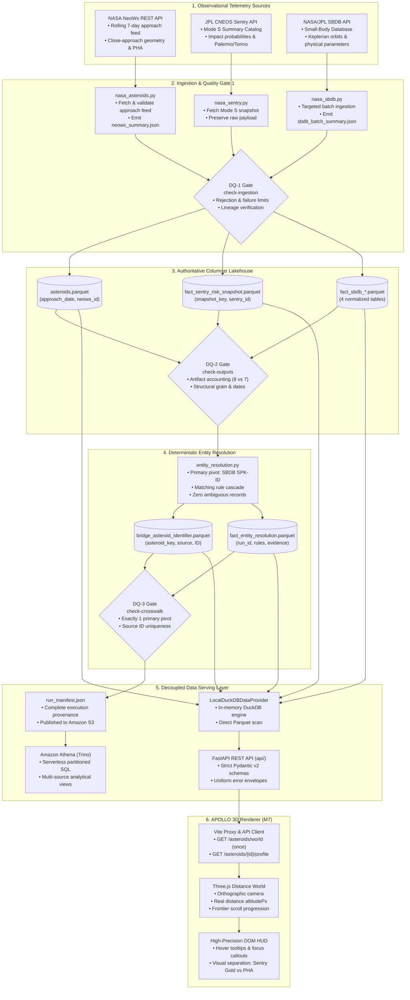
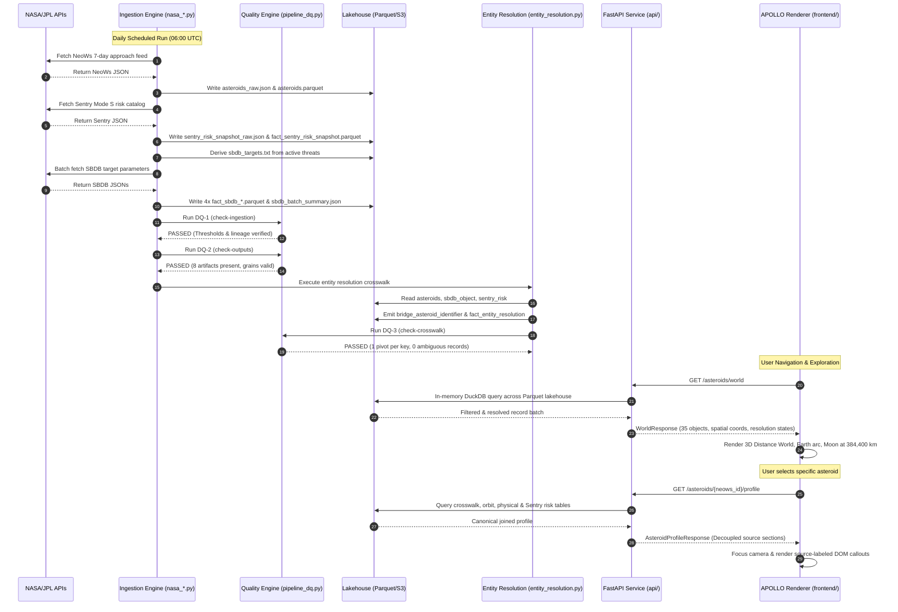
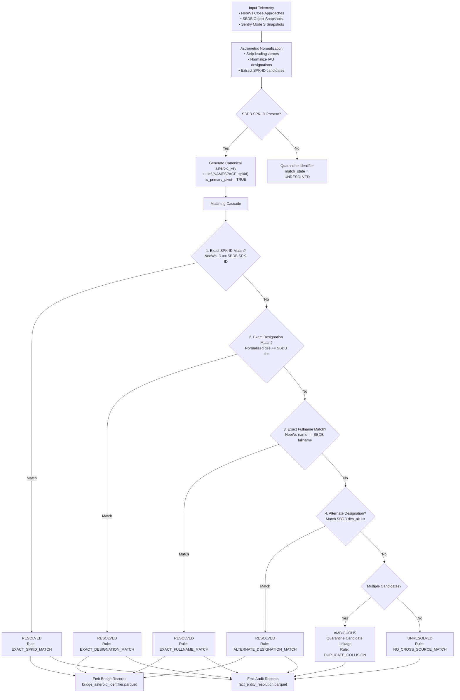
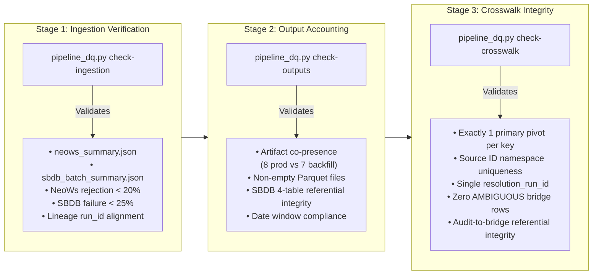

# APOLLO

**Asteroid Proximity & Orbital Location, Linkage & Observation**

APOLLO is a dual-core planetary defense intelligence platform uniting an automated NASA/JPL data lakehouse with an immersive 3D spatial renderer. The platform ingests, validates, and cross-references observational telemetry from NASA Near-Earth Object Web Services (NeoWs), JPL Small-Body Database (SBDB), and JPL CNEOS Sentry, resolving heterogeneous astronomical designations through deterministic entity resolution and serving authoritative data through a zero-cache FastAPI layer to a Three.js distance world.

[](https://python.org)
[](https://fastapi.tiangolo.com)
[](https://www.typescriptlang.org)
[](https://threejs.org)
[](https://parquet.apache.org)
[](https://duckdb.org)
[](https://vitejs.dev)
[](https://pytest.org)
[](https://vitest.dev)
[](https://github.com/astral-sh/ruff)
[](.github/workflows/ci.yml)

---

## Table of Contents

1. [Executive Summary & Core Philosophy](#1-executive-summary--core-philosophy)
2. [Comprehensive Tech Stack](#2-comprehensive-tech-stack)
3. [End-to-End System Architecture](#3-end-to-end-system-architecture)
4. [Multi-Source Dataflow Architecture](#4-multi-source-dataflow-architecture)
5. [Architectural Decisions & Trade-Offs](#5-architectural-decisions--trade-offs)
6. [Deterministic Entity Resolution Engine](#6-deterministic-entity-resolution-engine)
7. [Operational Data Quality Engine (DQ-1, DQ-2, DQ-3)](#7-operational-data-quality-engine-dq-1-dq-2-dq-3)
8. [FastAPI Data Serving Layer](#8-fastapi-data-serving-layer)
9. [APOLLO 3D Renderer (Distance World Model)](#9-apollo-3d-renderer-distance-world-model)
10. [Production Orchestration & CI/CD](#10-production-orchestration--cicd)
11. [Repository Structure](#11-repository-structure)
12. [Local Development Runbook](#12-local-development-runbook)
13. [Verification & Test Results](#13-verification--test-results)
14. [Operational Boundaries & Roadmap](#14-operational-boundaries--roadmap)

---

## 1. Executive Summary & Core Philosophy

Planetary defense data is inherently fragmented across specialized operational programs:
- **NASA NeoWs:** Operational tactical feed tracking close-approach events to Earth within rolling time windows.
- **JPL SBDB:** Master astrometric catalog supplying high-precision Keplerian orbital elements and physical properties.
- **JPL CNEOS Sentry (Mode S):** Autonomous collision monitoring system computing potential impact solutions over future centuries.

```
┌──────────────────────────────────────────────────────────────────────────────────┐
│                              THE APOLLO CORE DUALITY                             │
├────────────────────────────────────────┬─────────────────────────────────────────┤
│        BACKEND DATA PLATFORM           │           APOLLO 3D RENDERER            │
├────────────────────────────────────────┼─────────────────────────────────────────┤
│ • Ingestion of NeoWs, SBDB, Sentry     │ • TypeScript 5.5 + Three.js + Vite      │
│ • Deterministic Entity Resolution      │ • Single set-based fetch (/asteroids/world)│
│ • 3-Stage Data Quality Gates (DQ-1/2/3)│ • Monotonic altitudePx real-distance map│
│ • Snappy Parquet Lakehouse (PyArrow)   │ • Scroll-driven frontier exploration    │
│ • DuckDB in-memory query execution     │ • Strict separation: Sentry Gold halo   │
│ • Strict Pydantic v2 REST API (api/)   │   vs. NeoWs PHA warning badge           │
└────────────────────────────────────────┴─────────────────────────────────────────┘
```

### Non-Negotiable Scientific Guardrails
1. **Zero Composite Danger Formulas:** No synthetic "threat indices", "risk percentages", or heuristic weights are ever computed.
2. **Logarithmic Metric Integrity:** Arithmetic differences are never calculated over logarithmic exponents (such as Palermo Technical Scale ratings); only linear arithmetic deltas ($\Delta$) are emitted.
3. **Absence Does Not Mean Safe:** The absence of a Sentry impact record indicates unmonitored status or lack of catalog linkage, never confirmed safety.
4. **PHA Classification $\neq$ Sentry Threat:** A NeoWs Potentially Hazardous Asteroid (PHA) flag is an orbital proximity and magnitude classification; Sentry impact monitoring is a distinct mathematical collision solution. They are strictly decoupled.
5. **No Causal Overreach:** Metric changes across snapshots represent catalog updates from new observational arcs, never physical orbital decay or trajectory shifts.

---

## 2. Comprehensive Tech Stack

| Layer | Component | Version / Tooling | Architectural Role & Justification |
|---|---|---|---|
| **Ingestion Engine** | Python Core | `Python 3.11` | Robust standard library, type annotations, and native interoperability with scientific data libraries. |
| **HTTP Transport** | Requests & HTTPX | `requests 2.32`, `httpx 0.27` | Resilient ingestion via `requests` with exponential backoff; `httpx` as async ASGI client for contract testing. |
| **Columnar Storage** | Apache Arrow | `PyArrow 17.0` | Explicit schema enforcement, binary serialization, zero-copy record batches, and Snappy compression. |
| **Query Engine** | DuckDB & Athena | `duckdb 1.1`, `AWS Athena (Trino)` | Local zero-dependency columnar execution over Parquet; cloud serverless SQL over partitioned S3 lakehouse. |
| **Identity Engine** | UUID5 / Custom | `uuid.uuid5` (RFC 4122) | Deterministic SHA-1 canonical key generation anchored to a platform planetary defense namespace UUID. |
| **Quality Engine** | Custom DQ Engine | `pipeline_dq.py` | 3-stage pre- and post-resolution automated validation gates halting execution upon invariant breach. |
| **REST Serving** | FastAPI & Uvicorn | `fastapi 0.115`, `uvicorn 0.30` | Asynchronous ASGI REST server with auto-generated OpenAPI schemas and low-latency payload delivery. |
| **Data Validation** | Pydantic v2 | `pydantic 2.9` | Strict compile-time and runtime model validation (`extra="forbid"`, positive integer path patterns). |
| **3D Presentation** | Three.js | `three 0.169` | WebGL 3D rendering with instanced geometry, screen-space raycasting, orthographic projection, and custom shaders. |
| **Frontend Runtime** | TypeScript & Vite | `TypeScript 5.5`, `Vite 5.4` | First-class type safety, zero UI framework overhead (pure DOM HUD), fast HMR, and deterministic production builds. |
| **Testing & CI** | Pytest & Vitest | `pytest 8.3`, `vitest 2.1` | 662 backend unit/integration tests and 158 frontend unit/visual tests running fully offline and credential-free. |
| **Browser Torture** | Playwright | `playwright-core 1.48` | Real-browser headless stress verification for animation frame leaks, wheel scroll physics, and DOM callouts. |
| **Code Hygiene** | Ruff | `ruff 0.6` | Rust-based linter and formatter enforcing strict style, import sorting, and syntax integrity. |

---

## 3. End-to-End System Architecture

### High-Level Architectural Flow



---

## 4. Multi-Source Dataflow Architecture

### A. End-to-End Pipeline Dataflow



### B. Ingestion Source Grain & Metric Comparison

```
┌──────────────────────────────────────────────────────────────────────────────────┐
│                            SOURCE CHARACTERISTIC MATRIX                          │
├──────────────────────────┬────────────────────────────┬──────────────────────────┤
│        NASA NeoWs        │    JPL CNEOS Sentry Mode S │     NASA / JPL SBDB      │
├──────────────────────────┼────────────────────────────┼──────────────────────────┤
│ Ingestion Module:        │ Ingestion Module:          │ Ingestion Module:        │
│ • nasa_asteroids.py      │ • nasa_sentry.py           │ • nasa_sbdb.py           │
│                          │                            │                          │
│ Domain Scope:            │ Domain Scope:              │ Domain Scope:            │
│ • Operational encounters │ • Potential Earth impacts  │ • Keplerian orbits &     │
│ • Rolling approach feed  │ • Summary risk monitoring  │   physical parameters    │
│                          │                            │                          │
│ Primary Key / Grain:     │ Primary Key / Grain:       │ Primary Key / Grain:     │
│ • (approach_date,        │ • (snapshot_key,           │ • (snapshot_key, spkid)  │
│    neows_id)             │    sentry_id)              │                          │
│                          │                            │ Core Metrics:            │
│ Core Metrics:            │ Core Metrics:              │ • Semi-major axis (a)    │
│ • Miss distance (km)     │ • Impact probability (IP)  │ • Eccentricity (e)       │
│ • Relative velocity      │ • Palermo Scale (cum/max)  │ • Inclination (i)        │
│ • Estimated diameter     │ • Torino Scale (max)       │ • Absolute magnitude (H) │
│ • NeoWs PHA flag         │ • Impact year range        │ • Geometric albedo       │
│ • Approach timestamp     │ • Velocity at infinity     │ • Orbit condition code   │
│                          │                            │                          │
│ Storage Output:          │ Storage Output:            │ Storage Output:          │
│ • asteroids.parquet      │ • fact_sentry_risk_snapshot│ • fact_sbdb_object_snap  │
│ • asteroids_raw.json     │ • sentry_risk_raw.json     │ • fact_sbdb_orbit        │
│ • neows_summary.json     │                            │ • fact_sbdb_orbit_element│
│                          │                            │ • fact_sbdb_physical_par │
└──────────────────────────┴────────────────────────────┴──────────────────────────┘
```

---

## 5. Architectural Decisions & Trade-Offs

### Decision 1: Apache Parquet & PyArrow as the Single Authoritative Lakehouse Contract
- **Context:** Observational payloads arrive as nested JSON. Downstream consumers include AWS Athena, DuckDB, and statistical Python scripts.
- **Decision:** All operational workflows serialize validated data exclusively to Snappy-compressed Apache Parquet using rigid PyArrow schemas.
- **Rationale:** Columnar layout minimizes I/O overhead by up to 92% compared to JSON. Explicit PyArrow schemas prevent silent type coercion (e.g., float precision loss on astronomical distances).
- **Trade-Off:** Local inspection requires Parquet-aware tools or DuckDB, mitigating this by providing transient SQLite exports (`database.py`) strictly for ad-hoc debugging.

### Decision 2: SPK-ID as Canonical Primary Pivot & UUID5 Deterministic Keys
- **Context:** NeoWs uses numeric string IDs; Sentry uses alphanumeric designation hashes; IAU uses provisional designations. No single external ID spans all systems.
- **Decision:** The JPL Small-Body Database SPK-ID is designated the single canonical primary pivot (`is_primary_pivot == True`). Canonical asteroid keys are deterministically generated via `uuid.uuid5(NAMESPACE_PLANETARY_DEFENSE, spkid)`.
- **Rationale:** SPK-IDs are immutable ephemeris identifiers maintained directly by JPL's Solar System Dynamics Group. UUID5 ensures identical keys are generated across distributed nodes without coordination or central database sequences.
- **Trade-Off:** Objects present in NeoWs but absent from SBDB cannot receive an authoritative primary pivot and remain quarantined as `UNRESOLVED` until cataloged.

### Decision 3: Zero Synthetic Risk Scoring & Strict Scientific Guardrails
- **Context:** Common consumer platforms combine diameter, velocity, and distance into a synthetic "danger score" (e.g., 0–100).
- **Decision:** The platform completely prohibits composite scoring, weighted danger formulas, or percentage differences on logarithmic scales.
- **Rationale:** Planetary defense risk assessment is governed by the Palermo Technical Scale and Torino Scale. Synthetic formulas introduce pseudo-scientific distortion, misrepresent actual impact probabilities, and violate NASA scientific communication protocols.
- **Trade-Off:** The UI must display multi-dimensional data (miss distance, velocity, Palermo rating) rather than a single simplified badge, requiring sophisticated client-side visual design.

### Decision 4: Immutable Sentry Mode S Snapshots with Zero Backfill Fabrication
- **Context:** Historical backfills query NeoWs over arbitrary historical windows. Sentry, however, only exposes current mathematical risk solutions.
- **Decision:** Sentry ingestion captures immutable point-in-time snapshots (`fact_sentry_risk_snapshot`). Historical backfills skip Sentry ingestion entirely, executing entity resolution without Sentry inputs.
- **Rationale:** Sentry does not maintain retroactive historical risk solutions. Fabricating backdated Sentry snapshots would represent false historical intelligence.
- **Trade-Off:** Historical backfills contain null Sentry profiles (`sentry.status = "not_resolved"` or `"not_present"`), cleanly preserved in the API as absence of evidence.

### Decision 5: Three-Tier Centralized Data Quality Engine (`pipeline_dq.py`)
- **Context:** Automated pipelines risk publishing corrupt, partial, or unaligned datasets to cloud storage.
- **Decision:** Centralized operational DQ gates execute at three deterministic boundaries: `check-ingestion` (post-fetch), `check-outputs` (pre-resolution), and `check-crosswalk` (post-resolution). Any failure halts execution with exit code 1.
- **Rationale:** Decouples validation logic from ingestion scripts, guarantees summary-to-parquet lineage, and enforces crosswalk invariants before S3 publication.
- **Trade-Off:** Pipeline execution is fail-fast; a 25% failure rate in SBDB batch queries will abort the entire pipeline rather than publishing degraded crosswalks.

### Decision 6: Local In-Memory DuckDB as Storage-Agnostic Analytical Provider
- **Context:** The FastAPI serving layer requires sub-millisecond query response times over local Parquet files without managing a heavy persistent database daemon.
- **Decision:** `DashboardDataProvider` instantiates an in-memory DuckDB connection (`duckdb.connect(":memory:")`) executing vectorized queries directly over Parquet files.
- **Rationale:** DuckDB reads Parquet files with zero serialization penalty, supports full ANSI SQL window functions, handles missing files gracefully via typed empty relations, and requires zero external services.
- **Trade-Off:** File handles are opened per query execution; mitigated by DuckDB's internal thread-safe caching and sub-10ms query execution times.

### Decision 7: Decoupled REST Serving with Pydantic v2 `extra="forbid"`
- **Context:** API consumers (particularly 3D renderers) require rigid schema contracts where unanticipated keys or missing fields can break WebGL pipelines.
- **Decision:** All request parameters and response payloads are validated using Pydantic v2 models with `model_config = ConfigDict(extra="forbid")`. Path parameters strictly enforce positive integer regex (`^[1-9]\d*$`).
- **Rationale:** Catches schema drift immediately, guarantees semantic consistency between `data: null` (unlinked entity) and `data: []` (empty collection), and returns standard error envelopes.
- **Trade-Off:** Adding new backend fields requires explicitly updating schemas in `api/schemas.py`.

### Decision 8: Orthographic 3D Distance World with Monotonic Altitude Scaling
- **Context:** Displaying distances from 10,000 km to 100,000,000 km on a 2D screen causes extreme visual compression where close objects clump together.
- **Decision:** The renderer implements an orthographic camera in CSS-pixel units where world height follows a hybrid monotonic curve: logarithmic in near-Earth space (surface to Moon) and strictly linear above 1,000,000 km (14% viewport height per 1M km).
- **Rationale:** Guarantees that nearer objects always sit lower than farther objects, provides real separation for distant encounters, and ensures reversible scroll physics without camera clipping artifacts.
- **Trade-Off:** Horizontal placement cannot represent true celestial coordinates and is explicitly documented as illustrative (`sha256-uniform-sphere-v1`).

---

## 6. Deterministic Entity Resolution Engine

The resolution engine (`entity_resolution.py`) links the three heterogeneous identifier spaces through deterministic matching rules without heuristic fuzziness.



### Foundational Crosswalk Invariants Enforced by DQ-3
1. **Exactly One Primary Pivot:** Every canonical `asteroid_key` possesses exactly one record with `is_primary_pivot == True` (anchored to SBDB SPK-ID).
2. **Source Identifier Uniqueness:** Within any source system namespace (`neows`, `sbdb`, `sentry`), an identifier value maps to at most one `asteroid_key`.
3. **Zero Ambiguity Leakage:** No bridge record is generated in an `AMBIGUOUS` state. All ambiguous linkages are quarantined in the audit table with candidate evidence preserved.

---

## 7. Operational Data Quality Engine (DQ-1, DQ-2, DQ-3)



---

## 8. FastAPI Data Serving Layer

The serving layer (`api/`) is a read-only HTTP interface exposing the Lakehouse via `DashboardDataProvider`. It never interacts with external APIs or runs ad-hoc disk scans.

### API Endpoint Inventory

| Method | Endpoint | Data Grain / Description | Query / Path Parameters | Primary Response Models |
|---|---|---|---|---|
| `GET` | `/health` | System readiness & Parquet asset probe | None | `HealthResponse` |
| `GET` | `/asteroids/world` | **World Snapshot:** Entire NeoWs population with spatial coordinates & resolution states | None | `WorldResponse` |
| `GET` | `/asteroids/{neows_id}/profile` | **Unified Profile:** Source-separated dossier (Identity, Orbit, Physical, Sentry) | `neows_id` (`^[1-9]\d*$`) | `AsteroidProfileResponse` |
| `GET` | `/asteroids` | Filterable, paginated close-approach threat watchlist | `limit`, `offset`, `hazardous`, `sentry_monitored`, `horizon_mkm` | `WatchlistResponse` |
| `GET` | `/asteroids/{neows_id}` | Primary close-approach encounter telemetry | `neows_id` (`^[1-9]\d*$`) | `AsteroidDetailResponse` |
| `GET` | `/asteroids/{neows_id}/sbdb` | Authoritative JPL SBDB Keplerian orbital elements & physical parameters | `neows_id` (`^[1-9]\d*$`) | `SbdbResponse` |
| `GET` | `/asteroids/{neows_id}/sentry` | Authoritative JPL Sentry Mode S impact risk assessment | `neows_id` (`^[1-9]\d*$`) | `SentryResponse` |
| `GET` | `/asteroids/{neows_id}/history` | Longitudinal Sentry risk history across catalog snapshots | `neows_id` (`^[1-9]\d*$`) | `SentryHistoryResponse` |
| `GET` | `/asteroids/{neows_id}/crosswalk`| Multi-source identifier mappings from resolution bridge | `neows_id` (`^[1-9]\d*$`) | `CrosswalkResponse` |

### Uniform Machine-Readable Error Envelope
```json
{
  "meta": {
    "api_version": "1.0.0",
    "execution_mode": "LOCAL (DUCKDB / PARQUET LAKEHOUSE)",
    "timestamp": "2026-10-04T08:00:00+00:00"
  },
  "error": {
    "code": "TARGET_NOT_FOUND",
    "message": "Asteroid with NeoWs ID 99999999 not found in telemetry"
  }
}
```

---

## 9. APOLLO 3D Renderer (Distance World Model)

The APOLLO presentation layer (`frontend/`) is a TypeScript / Three.js application rendering real near-Earth asteroid encounters in a scroll-driven distance world.

```
══════════════════════════════════════════════════════════════════════════════════════
                          THE DISTANCE WORLD COORDINATE MODEL
══════════════════════════════════════════════════════════════════════════════════════
 Height (px)
    ▲
    │  ─── 100,000,000 km ───  Deep Space Domain Boundary
    │
    │  ─── 48,000,000 km ────  Distance Guide (1M km step = 14% Viewport Height)
    │        • (2010 TW54)     Real miss distance height; Gold Halo (Sentry Linked)
    │  ─── 47,000,000 km ────  Distance Guide
    │
    │  ─── 1,000,000 km ─────  Linear Transition Boundary
    │
    │  ─── 384,400 km ───────  MOON DISTANCE LANDMARK (Logarithmic scaling below)
    │
    │  ─── 100 km ───────────  Atmosphere Karman Line (Twilight sky gradient)
    │  ╭────────────────────╮
    │  │   EARTH HORIZON    │  Curved Earth Horizon & Surface Mesh (recedes on scroll)
────┴──┴────────────────────┴────────────────────────────────────────────────────────►
```

### Visual Encoding Principles
- **Monotonic Distance Reveal:** Asteroids fall in closest first as the exploration frontier reaches their exact miss distance. Nearer asteroids always rest lower in the world.
- **Sentry Gold Halo:** A gold material body, thin gold rim, and soft ambient halo denote an actual JPL Sentry monitoring link (derived solely from `sentry.status == "available"`).
- **NeoWs Hazard Badge:** A distinct yellow warning badge (⚠) indicates a NeoWs Potentially Hazardous Asteroid classification. It is never merged with Sentry status.
- **Deterministic Illustrative Direction:** Horizontal placement uses `sha256-uniform-sphere-v1` seeded strictly by `neows_id`. Distance is real; direction is illustrative.

---

## 10. Production Orchestration & CI/CD

### Scheduled Daily Pipeline (`.github/workflows/scheduled_pipeline.yml`)
The automated production pipeline executes daily at 06:00 UTC via a single-job runner enforcing strict concurrency protection:

```
┌──────────────────────────────────────────────────────────────────────────────────┐
│                      SCHEDULED PIPELINE EXECUTION SEQUENCE                       │
├──────────────────────────────────────────────────────────────────────────────────┤
│ 1. Workspace Cleanup        Purge transient files (*.parquet, *.json, *.txt)     │
│ 2. Mode Initialization      Set CURRENT_PRODUCTION or HISTORICAL_BACKFILL        │
│ 3. NeoWs Ingestion          python nasa_asteroids.py                             │
│ 4. Sentry Mode S Ingestion  python nasa_sentry.py (skipped in backfill)          │
│ 5. SBDB Target Generation   Extract threat IDs into sbdb_targets.txt             │
│ 6. SBDB Batch Ingestion     python nasa_sbdb.py --targets-file sbdb_targets.txt  │
│ 7. DQ Gate 1                pipeline_dq.py check-ingestion                       │
│ 8. DQ Gate 2                pipeline_dq.py check-outputs                         │
│ 9. Entity Resolution        python entity_resolution.py                          │
│ 10. DQ Gate 3               pipeline_dq.py check-crosswalk                       │
│ 11. S3 Lakehouse Publish    Upload bridge & audit Parquets to reference/...      │
│ 12. HeadObject Verify       pipeline_dq.py check-s3-publication                 │
│ 13. Execution Manifest      Generate run_manifest.json and upload to S3          │
│ 14. GitHub Step Summary     Render markdown diagnostic table                     │
└──────────────────────────────────────────────────────────────────────────────────┘
```

### Hardened Hermetic CI Gate (`.github/workflows/ci.yml`)
- **Zero Live Credentials:** Runs completely detached from AWS and NASA API keys.
- **Zero Network Egress:** All API calls are intercepted by local mock fixtures.
- **Strict Quality Enforcement:**
  - `git diff --check` (Zero trailing whitespace or newline discrepancies).
  - `ruff check .` (Zero lint or syntax issues).
  - `pytest -v` (Full execution of Python test suite).

---

## 11. Repository Structure

```
NASA-Intelligence-Platform/
├── .gemini/                             # Agent instructions and architectural invariants
├── .github/workflows/
│   ├── ci.yml                           # Hermetic pull-request quality gate
│   └── scheduled_pipeline.yml           # Scheduled daily production orchestration
│
├── backend/                             # Python Data Platform & Lakehouse Engine
│   ├── api/                             # FastAPI REST Serving Layer
│   │   ├── main.py                      # ASGI application factory & lifespan
│   │   ├── schemas.py                   # Pydantic v2 schemas (extra="forbid")
│   │   ├── service.py                   # Business logic & DuckDB adapter
│   │   └── routes/                      # Route handlers (/health, /asteroids)
│   ├── pipelines/
│   │   ├── ingestion/                   # NASA NeoWs, SBDB, and Sentry ingestors
│   │   ├── quality/                     # pipeline_dq.py operational DQ engine
│   │   ├── resolution/                  # entity_resolution.py crosswalk engine
│   │   └── utils/                       # pipeline_utils.py S3 & HTTP helpers
│   ├── sql/                             # Athena DDL schemas & analytical views
│   └── storage/                         # database.py & dashboard_data.py (DuckDB)
│
├── data/                                # Local Lakehouse Data Directory
│   ├── exports/                         # Transient SQLite DB & CSV exports
│   ├── lakehouse/                       # Authoritative Parquet snapshot tables
│   ├── raw/                             # Forensically preserved JSON payloads
│   └── reports/                         # Ingestion summaries & DQ audit reports
│
├── frontend/                            # APOLLO 3D Renderer (TypeScript / Three.js)
│   ├── src/                             # Three.js distance world, HUD & API client
│   ├── test/                            # Vitest unit & visual tests
│   └── e2e/                             # Playwright headless torture tests
│
├── tests/                               # Comprehensive Automated Test Suites
│   ├── api/                             # FastAPI REST contract & endpoint tests
│   ├── integration/                     # Pipeline, provider, and Athena view tests
│   └── unit/                            # DQ gate and utility unit tests
│
├── pyproject.toml                       # Python package configuration & build tools
├── render.yaml                          # Cloud deployment blueprint
├── requirements.txt                     # Pinned Python dependencies
├── architecture.md                      # Detailed technical architecture
└── README.md                            # Authoritative platform documentation
```

---

## 12. Local Development Runbook

### 1. Environment Setup
```bash
# Clone the repository
git clone <repository-url>
cd "Nasa Intelligence Platform"

# Initialize Python 3.11 virtual environment
python -m venv .venv
# On Linux/macOS:
source .venv/bin/activate
# On Windows PowerShell:
.venv\Scripts\Activate.ps1

# Install pinned dependencies
pip install -r requirements.txt

# Configure local credentials template
cp .env.example .env
```

### 2. Execute Data Ingestion Pipelines
```bash
# Ingest rolling 7-day NASA NeoWs approach telemetry
python nasa_asteroids.py

# Ingest JPL CNEOS Sentry Mode S risk catalog
python nasa_sentry.py

# Batch ingest target asteroids from Small-Body Database
python nasa_sbdb.py --targets-file sbdb_targets.txt

# Execute deterministic multi-source entity resolution
python entity_resolution.py \
    --neows-path asteroids.parquet \
    --sbdb-path fact_sbdb_object_snapshot.parquet \
    --sentry-path fact_sentry_risk_snapshot.parquet \
    --output-dir .
```

### 3. Run Centralized Data Quality Suite
```bash
# Execute complete unified operational DQ suite
python pipeline_dq.py run-suite --execution-mode CURRENT_PRODUCTION
```

### 4. Launch FastAPI Serving Layer
```bash
# Start local ASGI server on port 8000
uvicorn api.main:app --host 127.0.0.1 --port 8000 --reload

# Interactive Documentation:
# Swagger UI : http://127.0.0.1:8000/docs
# ReDoc UI   : http://127.0.0.1:8000/redoc
```

### 5. Launch APOLLO 3D Renderer
```bash
cd frontend
npm install
npm run dev

# Open http://127.0.0.1:5173 (proxies /api to localhost:8000)
```

---

## 13. Verification & Test Results

The platform is backed by extensive automated test coverage across backend, API, and frontend layers:

```
┌──────────────────────────────────────────────────────────────────────────────────┐
│                         AUTOMATED TEST SUITE EXECUTION                           │
├────────────────────┬───────────┬──────────────┬──────────────────────────────────┤
│ Suite              │ Runner    │ Results      │ Scope                            │
├────────────────────┼───────────┼──────────────┼──────────────────────────────────┤
│ Python Platform    │ Pytest    │ 662 Passed   │ Ingestion, DQ-1/2/3, Resolution, │
│                    │           │ 1 Skipped    │ DuckDB provider, API contracts   │
│ APOLLO Renderer    │ Vitest    │ 158 Passed   │ Reveal math, Three.js lifecycle, │
│                    │           │ 0 Failed     │ DOM HUD, coordinate monotonicity │
│ Code Style         │ Ruff      │ Clean        │ Zero lint warnings or syntax bugs│
│ Type Checking      │ TypeScript│ Clean        │ Zero type errors under strict mode│
└────────────────────┴───────────┴──────────────┴──────────────────────────────────┘
```

Execute all automated verification suites:
```bash
# Run backend Python tests
pytest -q

# Run frontend tests
cd frontend && npm test -- --run

# Run code style linter
ruff check .
```

---

## 14. Operational Boundaries & Roadmap

### Documented Operational Boundaries
- **Local-First Serving:** The API is unauthenticated and rate-limit free, designed for secure private VPC or container environments.
- **Athena Provider:** `AthenaDataProvider` is prepared in `dashboard_data.py` but currently defers to `LocalDuckDBDataProvider`.
- **Sentry Granularity:** Ingestion captures Mode S (catalog summary); Mode O (individual potential impact solutions) is not ingested.
- **Directional Semantics:** Asteroid directional vectors are deterministic and illustrative (`sha256-uniform-sphere-v1`); only miss distance is real.

### Future Architectural Roadmap
- **Event-Driven Streaming:** Transitioning scheduled batch ingestion to event-driven triggers via AWS EventBridge and Kafka.
- **N-Body Gravitational Ephemerides:** Integrating SPICE kernels for dynamic multi-body trajectory propagation.
- **Containerized ECS Deployment:** Docker packaging with AWS ECS / Fargate deployment recipes for cloud serving.
